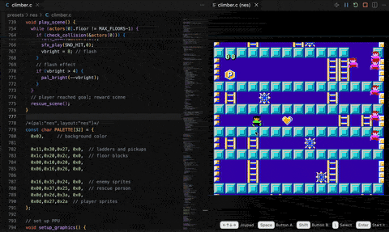

# 8bitworkshop for VS Code

The original online 8-bit IDE, now in VS Code!

Write programs for classic consoles and computers, then build and play
them without leaving VS Code.

This extension uses the assemblers,
compilers, and emulators from [8bitworkshop.com](https://8bitworkshop.com).

Supported platforms include 6502, Z80, and 6809 CPUs:

- **NES / Famicom**
- **Atari 2600 (VCS)**, **Atari 7800**, and **Atari 8-bit** computers
- **Commodore 64** and **VIC-20**
- **ColecoVision**, **MSX**, **ZX Spectrum**, **Amstrad CPC**
- **Apple II**, **Game Boy**, **Sega Master System**, **PC Engine**
- **Arcade hardware** (Galaxian, Space Invaders, Pac-Man, Williams, VIC Dual, Atari Vector)

Supported programming languages include:

- **Assembler** with DASM, ca65, zmac, and more
- **C** with CC65, SDCC, and more
- **BASIC** with batariBASIC and FastBASIC
- **Verilog** for hardware design
- ...and others! There's a lot going on in here!

All building and emulation runs on your computer. The toolchains and
examples are included; only a few platforms, such as Verilog, download an
extra component the first time you use them.

## Get started

1. Open an empty window. In the Explorer, click **New 8bitworkshop
   Project**, or run **8bitworkshop: New Project...** from the Command
   Palette.
2. Choose a platform, such as **NES** or **Atari 2600 (VCS)**.
3. Choose a blank program or an example, then a folder to copy it to.
4. Click **Run** (▷) at the top right of the editor. The emulator opens
   beside your code.
5. Click the emulator to play. Click your code to type again.

Change something and the game rebuilds and restarts as you type. Errors
appear as red underlines and in the **Problems** panel, and the last
version that built keeps running until you fix them.

To look at the included examples without copying them, run **8bitworkshop: Open Example**.

To use code you already have, open its folder: the extension detects the appropriate platform and main file.

## Settings

| Setting | What it does |
|---|---|
| `8bitworkshop.platform` | The platform, such as `nes`, `c64`, or `vcs` |
| `8bitworkshop.mainFile` | The file that runs. Empty: the file in the editor |
| `8bitworkshop.autoBuild` | `onType` (default), `onSave`, or `off` |
| `8bitworkshop.reloadOnBuild` | `always` (default), `onSave`, or `never` |
| `8bitworkshop.toolchainPath` | Use a local 8bitworkshop checkout instead of the included toolchains |

8bitworkshop saves your choices in `.vscode/settings.json`. Commit it so
people who clone your repo skip the questions.

## More

- [Projects and the file that runs](https://github.com/sehugg/8bitworkshop/blob/master/extension/docs/projects.md)
- [Platform detection](https://github.com/sehugg/8bitworkshop/blob/master/extension/docs/detection.md)
- [Building](https://github.com/sehugg/8bitworkshop/blob/master/extension/docs/building.md)
- [The emulator](https://github.com/sehugg/8bitworkshop/blob/master/extension/docs/emulator.md)
- [Report a problem](https://github.com/sehugg/8bitworkshop/issues)

## License

GPL-3.0. The included components (toolchains, emulators, libraries, firmware,
etc.) keep their own licenses; see [THIRD-PARTY-NOTICES.md](THIRD-PARTY-NOTICES.md).

